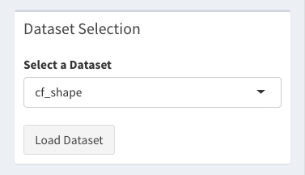

[TOC]

This is the design document for soil data visulisation web dashboard, Soil Data Explorer, which is written in R and Shiny. In this design document, we introduce the project structure, the functionalities, and the underlying design patterns.

## Project Structure

The project is organised as below:

```markdown
data/
src/
ui.R
server.R
```

At the root level, we have two folders and two R scripts. Our web dashboard, a Shiny application, simply consists of these two R scirpts. As the names suggest, `ui.R` defines the ui layout of the dashboard, and `server.R` defines the "server side" logic of the web dashboard. More on this later. 

As for the two folders, the `data/` folder stores all the datasets in `.csv` format and the `src/` folder is used to store all the R scripts that `ui.R` and `server.R` use and reply on. 

**Note** 

All the .csv files in the `data/` folder must have the columns: `X`, `o_longitude_GDA94`, and `o_latitude_GDA94`. The column `X`, which stores all the indexes in natural number form, serves as an ID for each column. As such, we do not  allow missing values in `X`. The columns `o_longitude_GDA94` and `o_latitude_GDA94` however allow missing values. In fact, all the data points with incomplete geolocations are filtered out and can be viewed as an independent data table in the dashboard. 

When a new .csv dataset is added to the `data/` folder, its name needs be added to the `datasets.R` script, located in the `src/` folder. 

## Functionalities 

In this section, we break down the different sections provided in Soil Data Explorer dashboard.

### Data Selection

`Data Selection` section allows the user to load a dataset from a set of datasets. When a dataset is loaded, the data points are breaking into two datatables:

1. A datatable for data points with a missing or incomplete geolocation, and
2. A main datatable with data points that have a complete geolocation

The UI layout is as follows.



<center>Data Selection UI</center>

Data is only loaded after the `Load Dataset` button is clicked. 

### DataTable Data Summary

In the `DataTable Data Summary` section, we have a dropdown select input whose options are the names of the columns in the main datatable. After a column has been selected, by clicking on the `Show Summary` button, a basic statistical summary of the selected column will show up. 

<center>
  <p>
    
    <br>
    <em>DataTable Data Summary - Before Click</em>
  </p>
  <p>
    
    <br>
    <em>DataTable Data Summary - Before Click</em>
  </p>
</center>

As can be seen from the figures above, when the `Show Summary` button is clicked, the button text changes to `Hide Summary`.

### Dataset Trimming

As all the data points come from relational data tables, it is understandable that not every column is going to be meaningful. Moreover, some datasets might contain many columns, distracting a user from focusing on the ones that matter. Therefore, we want to offer the user the flexibility to hide any columns of his or her choice.  

<center>
  <p>
    
    <br>
    <em>Dataset Trimming - Before Click</em>
  </p>
    <p>
    
    <br>
    <em>DataTable - Before Trimming</em>
  </p>
  <p>
</center>

<center>
  <p>
    
    <br>
    <em>Dataset Trimming - After Click</em>
  </p>
  <p>
    
    <br>
    <em>DataTable  - After Trimming</em>
  </p>
</center>

To undo the "data trimming", simply remove all the selected columns and click the `Hide Selected Columns` afterwards.

### Data Filtering

In this section, we allow a user to filter the current datatable further by selecting a column and a value from that column as the filter. For example, a user may only wish to see all the data points from the agency 199. 

<center>
  <p>
    
    <br>
    <em>Data Filtering - Before Click</em>
  </p>
</center>

Notice that a user can choose between applying the filter to the whole dataset and applying the filter to only the current datatable. When the `Apply Filter` button is clicked, the data points that meet the filter criteria will be highlighted on the geo map (which will be introduced later) and displayed in the datatable. 

<center>
  <p>
    
    <br>
    <em>Geo Map - After Filtering</em>
  </p>
</center>

After a filter has been applied, the button will change from `Apply Filter` to `Remove Filter`. By clicking on the `Remove Filter` button, any applied filter will be removed. The highlighted data points on the geo map will of course be removed accordingly.

### Geolocation Map

Geolocation Map is used to display all the data points wtih complete and valid geolocations in the loaded dataset. 

<center>
  <p>
    
    <br>
    <em>Geo Map</em>
  </p>
</center>


Moreover, this map supports the following advanced features:

1. Allow a user to select areas of the map: when there are data points in the selected data points, the selected data points will be highlighted and that the datatable will be updated accordingly. As a conscious decision, we do not allow data points to be selected by multiple shapes. When overlaps occur, the user will be prompted. 

2.  When a filter is being applied, the data points that meet the filter criteria will be highlighted. 

3. As a user moves the map, this includes zooming in and out, the main datatable will be updated: those data points in the current map bound will be displayed. The exceptions to this general rule are:

   i.  When a filter is being applied, moving the map around will further filter the datatable.

   ii. When there are areas of the map being selected, moving around the map will not update the datatable. 

<center>
<p>
  <image src="./images/geo_map_zoom.gif"></image>
  <br>
  <em>Geo Map - Zoom In and Out</em>
</p>
</center>

### DataTable

For the two datatables, besides the built-in functions like page length options and pagination, download buttons are attached so that a user can download any of the two datatables in their current states.

For the `Missing Geolocations` section, the datatable for all the data points with incomplete or missing geolocations is initially hidden. A user can view the datatable by clicking on the `Show Incomplete Geolocations` button to display the datatable. After the datatable is shown, the button will change to `Hide Incomplete Geolocations`. 


### Plot

As for the plot section, a user can choose between the various plots and generate any one of them with the current set of data points in the main datatable. 

<center>
<p>
  <image src="./images/plot_selection.gif"></image>
  <br>
  <em>Plot - Selection</em>
</p>
</center>

When a plot is selected, only those columns that meet the criteria of the current selected plot will be provided. For example, for a boxplot, only (continuous) numerical values make sense. As such, we filter out the columns that do not make sense for a boxplot. 

A plot is only generated when the `Plot` button is pressed. 


## Design Patterns

### UI

The following UI patterns are particularly interesting in this project:

* Show/hide UI elements on events
* Update UI on events
* Dynamically generate UI elements

<center>
  <p>
    
    <br>
    <em>Show and Hide UI Elements</em>
  </p>
</center>

It is useful to show/hide certain UI elements when certain events take place, like the pressing of a button. In Shiny, to do this, the API `conditionalPanel` comes in handy:

```R
# ui.R
# ...
conditionalPanel(
	condition = "output.condition",
  p("ui elements to show/hide on output.condition")
)
actionButton(
  inputId = "button_press",
  label = "Show"
)

# server.R
# ...
rv <- reactiveValues(
	condition = FALSE
)

output$condition <- reactive({
    rv$condition
})

observeEvent(input$button_press, {
  rv$condition <- !rv$condition
  if (rv$condition) {
    updateActionButton(session, inputId = "inputId", label = "Hide")
  }
  else {
    updateActionButton(session, inputId = "inputId", label = "Show")
  }
  outputOptions(output, "condition")
})
```

When the `input$button` event is triggered, the code block in the observeEvent function will be executed. The change of `rv$condition`, a reactive value, will trigger the change of `output$condition`. Finally, with the API `outputOptions`, we are sending the newest value `output.condition` to the UI front-end. The UI element(s) in `conditionalPanel` will be shown or hidden according to the value of `output.condition`.

Also shown in the above example is the updating of an UI element. Shiny provides APIs for updating almost all UI elements. 


**To add: Dynamically generate UI elements **


For more details, please refer to the official Shiny documentation. 


### Event Handling and Reactivity


```html
<center>
  <p>
    
    <br>
    <em></em>
  </p>
</center>
```